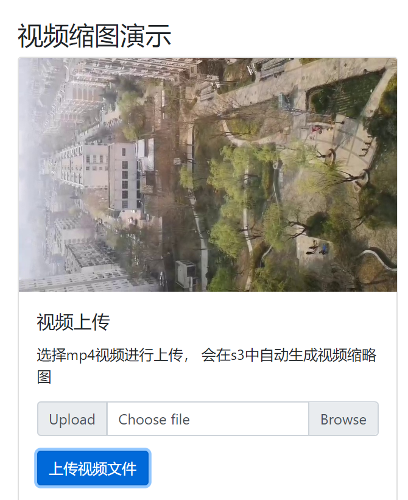

# 免责说明
建议测试过程中使用此方案，生产环境使用请自行考虑评估。 
当您对方案需要进一步的沟通和反馈后，可以联系 nwcd_labs@nwcdcloud.cn 获得更进一步的支持。 
欢迎联系参与方案共建和提交方案需求, 也欢迎在 github 项目issue中留言反馈bugs。    

# 项目介绍

通过网页直接上传文件(.mp4)到S3，触发Lambda函数，生成一张截图。
网页上传文件所需的 访问密钥 ID(Access key ID，简称AK) 和 私有访问密钥(Secret access key，简称SK) 从API Gateway获取，API Gateway调用Lambda函数获取Session Token，网页使用Session Token来上传文件。

#示例图

# 步骤

1. 下载项目到本地
2. 使用cdk部署，记录下authUrl和S3BucketName
3. 修改[web/a.js](./web/a.js)中的AUTH_URL、bucketName值。
4. 然后在浏览器中打开 [./web/index.html](./web/index.html)即可上传文件和生成缩略图